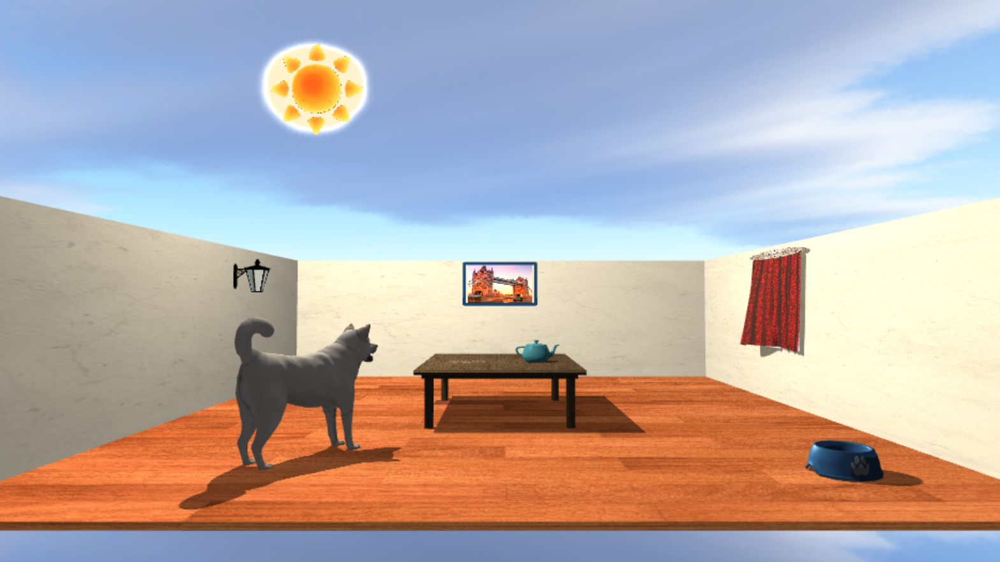
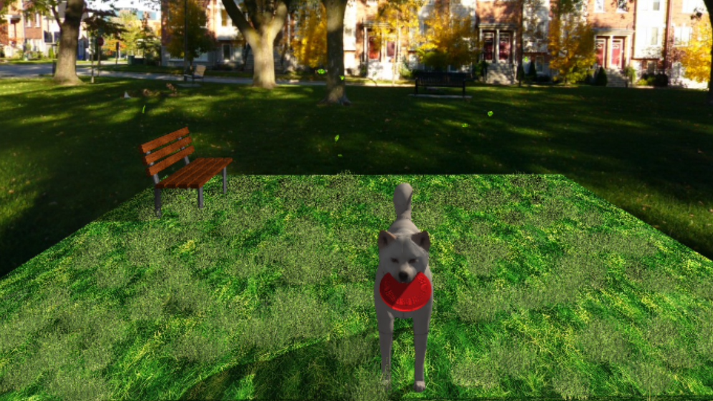
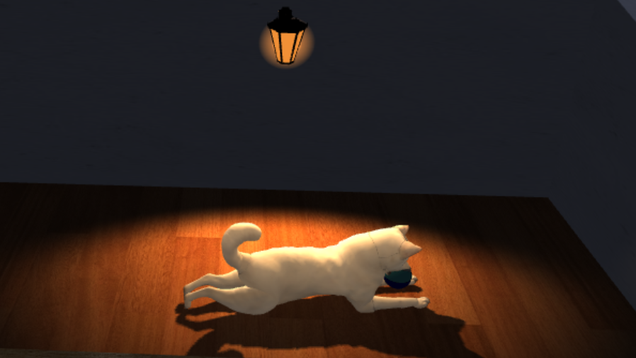
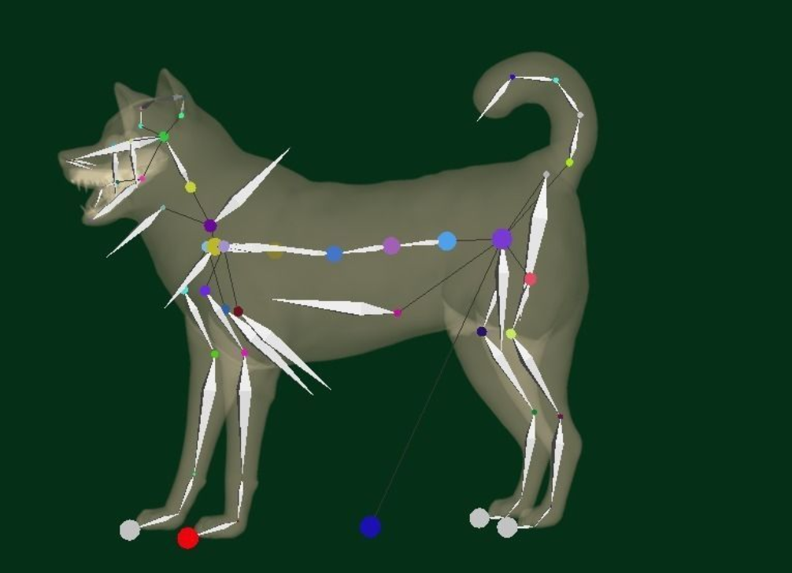

# Pet Room 🐾  

<!-- Badge -->


### A WebGL virtual pet room inspired by Nintendogs-style interactions


# Live Demo through GitHub Pages

> **Recommended:** open the demo with **Google Chrome** and enable **GPU acceleration** for the best experience.

https://sapienzainteractivegraphicscourse.github.io/final-project-camydog_igproject/

## Compatibility

- ✅ **Recommended:** Google Chrome with GPU acceleration enabled.
- ⚠️ Performance may be slower on browsers without hardware acceleration.
- 🎯 **Target performance:** 60 FPS, optimized for displays with a maximum refresh rate of 60 Hz.
- 💡 A **Performance Saver mode** is available from the start settings panel.


# Exam material
The instruction manual for the exam is in this repository : it's the report_petRoom.pdf file

<!-- https://canva.link/6hl5piamvf281bk -->

# Overview
Pet Room is an interactive WebGL project developed for the Interactive Graphics course 2025/26.  
The scene represents a virtual pet environment where the user can interact with a rigged dog, switch between home and park scenes, play small minigames, and observe dynamic lighting, shadows, physics-based objects, and UI controls.

The project combines custom WebGL rendering, hierarchical/skinned animation, shadow mapping, Cannon.js physics, audio feedback, and interactive controls.

| Home Scene | Park Scene | Shadow Demo |
|---|---|---|
|  |  |  |


# Main Features & Technical Highlights

| Area | Description |
|---|---|
| **Virtual pet interaction** | The user can call the dog, pet it, give water and food, and trigger different interaction states. |
| **Scenes** | The project includes two environments: an indoor room and an outdoor park. |
| **Skyboxes** | Different skybox backgrounds are used for the home scene, park scene and night mode. |
| **Rigged dog animation** | The dog uses a rigged/skinned 3D model with walking, tail movement, eating/drinking poses and reaction animations. |
| **Physics simulation** | Cannon.js is used for the ball simulation, collisions and cloth curtain behavior. |
| **Minigames** | The scene includes ball throw, frisbee throw, teapot chase interactions and a teapot break event triggered by the ball. || **Dynamic lighting** | The project supports day/night mode, moving sun, moon visualization and an interactive wall lamp. |
| **Shadow mapping** | Dynamic shadows are implemented for the main light, point light and wall lamp shadow demos. |
| **Interactive controls** | Camera controls, light sliders, ball physics sliders, teapot controls, UI buttons and optional gamepad interaction are available. |
| **Audio system** | Background music, sound effects and global audio controls are integrated. |
| **Optimization** | A Performance Saver mode reduces expensive effects on slower devices. |

# Controls

| Feature | Control | Description |
|---|---|---|
| Orbit camera | Left mouse drag | Rotate the camera around the scene. |
| Pan camera | Right mouse drag / W A S D | Move the camera target. |
| Zoom | Mouse wheel | Move the camera closer or farther. |
| Move main light source | Light X / Light Y / Light Z sliders | Change the position of the main point light. |
| Switch day/night | Moon/Sun button | Toggle between day and night lighting. |
| Auto sun movement | Auto Sun button | Enable or disable automatic sun movement. |
| Wall lamp | Wall Lamp button | Toggle the wall lamp during night mode. |
| Give water / food | Water and Food buttons | Fill the dog bowl and trigger dog interaction. |
| Call dog | Call Dog button + click on floor | Select a target position for the dog. |
| Pet dog | Pet mode button | Enable pet interaction mode. |
| Ball minigame | Ball button | Start or stop the ball minigame. |
| Frisbee | Frisbee button | Throw the frisbee in the park scene. |
| Teapot Chase | Teapot button | Start the teapot chase minigame. |
| Show colliders | Show Colliders button | Toggle physics collider visualization. |
| Shadow demo controls | Shadow demo panel | Rotate objects or start the wall lamp shadow demo. |
| Ball throw settings | Ball settings sliders | Adjust velocity, angular velocity, bounce, friction and damping of the ball. |
| Teapot Chase controls | Keyboard / Gamepad | Move, rotate and raise/lower the teapot during the Teapot Chase minigame. |


### Ball Minigame Controls

| Control | Action |
|---|---|
| Ball button | Start or stop the ball minigame |
| Vel X / Vel Y / Vel Z sliders | Change the initial throw velocity of the ball |
| Bounce slider | Change how much the ball bounces |
| Friction slider | Change how much the ball slows down on contact |
| Ang X / Ang Y / Ang Z sliders | Change the initial angular velocity of the ball |
| Linear damping slider | Control how quickly the ball loses linear speed |
| Angular damping slider | Control how quickly the ball stops rotating |

### Teapot Chase Controls

| Input | Action |
|---|---|
| I / J / K / L | Move the teapot |
| Arrow keys | Rotate the teapot |
| Q / E | Lower / raise the teapot |
| R | Toggle teapot rotation |
| Gamepad left stick | Rotate the teapot |
| Gamepad right stick | Move the teapot |
| Gamepad LT / RT | Lower / raise the teapot |
| Gamepad A | Toggle teapot rotation |


## Technical Highlights

### Rendering


The project is rendered using WebGL 1.0 with custom vertex and fragment shaders.  
Most scene objects use a Blinn-Phong style illumination model with ambient, diffuse and specular components, combined with textured materials, normal transformations and shadow receiving/casting behavior.

### Rigged Dog Animation

The dog character is based on a rigged/skinned 3D model.  
Its skeleton is used to animate walking, tail movement and interaction poses such as eating, drinking, following targets and reacting to the user.

<p align="center">
  
</p>

<p align="center">
  <em>Rigged dog model with visible bone and joint hierarchy used for animation.</em>
</p>


A bone hierarchy diagram is available here:
[dog rig hierarchy diagram](https://mermaid.live/edit#pako:eNqdl2tv2jAUhv-KZalSK1GaKwU-TEpDNrIFUiWZJnWZIou4NGpI0FnYrep_n2EKBGI7rHwBx-9zfHxe28EveFGmFI_xEsj6CUWTGOICsc_FBbqzbHfuoxsU-H6ELgOSZguKUpqjFWPyvLyqxVvB5dcYfynzx2TbCKcfiwpd3pFFVpQ3QVlWVzH-doWur9-hnShcZwVNFHUnbIY5SPJkmhWpR5fsey3RwZm6iGQ5GzFRtL2oMdnw3p1baOIHoeU59fN2qq0ZaEcjtntagC4EdD5gCAGDC0TlmjfBiRtYM-vB9ecOsn3P85HDJm153NnWMQ6x53TxfOqXFMgTOyc_skVOd0X_DxJEZGM29QwiJ4yso6jNRPnpJ4qi1ou1-bzPnrNVenY0jvXNjhN505atvs0Jil4_bqVddwjz7g6oiQJqbwyoiwLqbwxoiAIaZwbME4eAaAkKGHgDM6UkTT6Sn7zVOrNC2_E8iy1Yz51_-Hy8Yo_IdkCnSNtJCJioLJYbenLK7aFWLxfUpaAuBg3e1P3Ase2pe3zInHrCc4uTPwgx4GCNJB6s2b2FrHnkBC5LCIXu3A2jwDpJinPsdJxnzT3JFfD2ZudA76EsKt4LTdTPhT8VlErpvYCLW8VzLucPCm6AO5LnUn4v4OJRSc-xcuK0jAR5faHLSDjXyM6B5EaCzEjoMhKkRkKnkSA3ErqMBKmRcKaR937YsSlP_9zx_iBuC6Dy1lpbIMK1LlwT4sKd0hbwcNE-afXz4HOLy90m4tJCV2lBWlroKi1ISwtdpQVpaaGjtCArLXSV1vYnx3U8uVdwLhy8N-pxHwcyJJAhgsxdB-6x61yW4nEFG9rDKworsm3il22wGFdPdEVjPGY_U_pINnkV47h4ZdiaFA9luapJKDfLJzx-JPl31tqsU1LRSUbYXfEgoUVKwS43bNixqiijXRA8fsG_8PjaUPqmpqraaKAMVdPQe_g3U5lKnzWMkanpI828Hb728J_dqEp_NBrcDvXBSB2Y-tDUtB6maVaVMPt3S91dVl__AuV5xks)


### Lighting and Shadows
The scene includes a main light source, day/night mode, a moon/sun visual marker and an optional wall lamp used during night mode.  
Shadow mapping is used to project dynamic shadows from moving objects and interactive demos.

### Physics
Cannon.js is used for physics-based interactions, including the ball simulation and the cloth curtain near the window. During the ball minigame, the launched ball can collide with the teapot.  
When this happens, the intact teapot is temporarily hidden and replaced by small animated fragments, creating a lightweight procedural break effect.  
The teapot is restored when the ball minigame is stopped.

### Animation
The dog uses a rigged/skinned model with animated bones for walking and interaction poses.  
Additional objects use procedural animation, such as teapot rotation, fireflies and object movement.

### Interaction System
The user can interact with the dog and the environment through UI buttons, sliders, mouse controls and optional gamepad-style interactions.


# 3D Model Sources

## Procedurally Generated & Code-Created Geometry

The following scene elements are generated directly in code using custom buffers, primitive geometry, procedural meshes or runtime simulation:

| Element | Description |
|---|---|
| **Room structure** | Floor, back wall and left wall generated from box buffers and transformed with model matrices. |
| **Right wall with window** | Custom wall mesh generated with a window opening. |
| **Painting and frame** | Built from box geometry; the image and frame use textures. |
| **Water surface** | Procedural disk mesh used to represent the water inside the bowl. |
| **Kibble pieces** | Procedurally generated food particles. |
| **Curtain cloth** | Runtime cloth mesh animated through Cannon.js physics. |
| **Curtain rod / support** | Procedural support geometry generated in code. |
| **Sun halo** | Billboard quad generated from manually defined vertices and texture coordinates. |
| **Fireflies** | Procedural sphere meshes with generated color texture. |
| **Debug colliders** | Simple generated helper geometry used to visualize physics colliders. |

## Third-Party & Imported 3D Models

All third-party models remain the property of their respective authors and marketplaces.  
Some assets were purchased or downloaded under the license terms provided by the original platform.  
They are included in this repository only for academic evaluation and university exam grading.

> **Asset usage notice:**  
> The 3D models included in this project must not be extracted, redistributed, resold, or reused as standalone assets.  
> Anyone interested in using these assets should download or purchase them from the original sources listed below and follow the corresponding license terms.

| Asset | Source | Notes |
|---|---|---|
| Kishu Inu Dog | [CGTrader](https://www.cgtrader.com/3d-models/animal/mammal/kishu-inu-japan-dog-breed) | Purchased rigged/skinned dog model used as the main pet character. |
| Grass Patch | [CGTrader](https://www.cgtrader.com/3d-models/plant/grass/photorealistic-grass-with-patch-generator-and-animatio) | Purchased grass asset used in the park scene. |
| Moon | [CGTrader](https://www.cgtrader.com/items/6369973/download-page) | Imported model used for night mode visualization. |
| Sun | [CGTrader](https://www.cgtrader.com/items/5092264/download-page) | Imported model used for day mode visualization. |
| Frisbee | [CGTrader](https://www.cgtrader.com/3d-models/sports/toy/flat-disc-frisbee) | Purchased model used in the frisbee minigame. |
| Leaf | [CGTrader](https://www.cgtrader.com/free-3d-models/plant/leaf/tree-leaf) | Imported model used for park/environment details. |
| Bench | [CGTrader](https://www.cgtrader.com/free-3d-models/exterior/street-exterior/park-bench-modern-outdoor-bench-long-seat) | Imported model used in the park scene. |
| Music Note | [CGTrader](https://www.cgtrader.com/free-3d-models/various/various-models/music-note-33d9edfd57a7bc1b72f2d9dedbea46e5) | Imported model used as dog feedback/interaction effect. |
| Wall Lamp | [CGTrader](https://www.cgtrader.com/free-3d-models/exterior/street-exterior/wall-lamp-35a16b45-0427-4a69-907c-709c1568032d) | Imported model used for the night wall lamp and shadow demo. |
| Dog Bowl | [CGTrader](https://www.cgtrader.com/items/6235171/download-page) | Imported model used for food and water interactions. |
| Ball | [Free3D](https://free3d.com/it/3d-model/beach-ball-v2--259926.html) | Imported model used in the ball minigame. |
| Table | [Free3D](https://free3d.com/3d-model/tablle-396579.html?dd_referrer=) | Imported model used in the home scene. |
| Heart | [Free3D](https://free3d.com/3d-model/heart-v1--539992.html) | Imported model used as pet interaction feedback. |
| Teapot | Interactive Graphics Course material | Course-provided model used for rendering and minigame interaction. |

<!-- # 🎨 Texture References

### 📂 Local Models & Textures
*Included directly within the project folders:*
- **Kishu Inu Japan Dog** (Model folder)
- **Ball** (Model folder)
- **Bench** (Model folder)
- **Table** (Model folder)
- **Grass patch** (Model folder)

### 🌐 External Images
*Sourced from external search engines:*
- **Moon** (Google Images)
- **Sun texture** (Google Images)
- **London image** (Google Images)

### 💻 Procedurally Generated
*Colors and effects generated dynamically via code:*
- **Fireflies** (Generated color)
- **Frisbee** (Generated color)
- **Music note** (Generated color)
 -->
# 🎨 Texture References

This project uses a combination of imported texture maps, local texture files, external image textures and procedurally generated colors.


## Skybox Textures

All skybox textures used in the project are from **OpenGameArt**.

The project uses different skybox backgrounds for the indoor scene and the outdoor park scene.  
The home scene has separate day and night skybox textures, while the park scene reuses the day skybox and adapts it visually through the night lighting setup.

| Skybox | Usage |
|---|---|
| **Home / Day skybox** | Background environment for the indoor scene during day mode. |
| **Home / Night skybox** | Background environment for the indoor scene during night mode. |
| **Park skybox** | Background environment for the outdoor park scene. In night mode, this skybox is reused and modified through lighting. |


## Imported Model Texture Folders

Some texture maps are included together with the corresponding imported 3D models and are stored locally in the project folders.

| Texture folder / asset | Used for |
|---|---|
| **KishuInu_tex** | Texture maps for the rigged dog model. |
| **Bench_tex** | Bench material maps used in the park scene. |
| **Bowl_tex** | Bowl material maps, including normal and roughness details. |
| **Table_tex** | Table material maps, including color, specular and ambient occlusion maps. |
| **WallLamp_tex** | Wall lamp material maps, including base color, normal and roughness maps. |
| **Grass patch** | Grass asset texture used for the park vegetation |
| **Sun** | Texture maps included with the imported sun model. |
| **Leaf** | Texture maps included with the imported leaf model. |


## Procedurally Generated Colors and Effects

Some visual elements do not rely on image files, but are generated directly in code using solid colors, alpha values or procedural geometry.

| Element | Procedural usage |
|---|---|
| **Teapot color** | Generated with a solid-color texture. |
| **Teapot break fragments** | Procedural break animation triggered when the ball hits the teapot during the ball minigame. |
| **Water surface** | Generated with a transparent blue solid-color texture and applied to a procedural disk mesh. |
| **Kibble pieces** | Generated with a solid brown color and procedural geometry. |
| **Fireflies** | Generated with a solid yellow color and sphere geometry. |
| **Sun halo billboard** | Procedural billboard quad combined with a halo texture, alpha blending and a small pulse animation. |
| **Debug colliders** | Rendered with simple generated helper geometry and transparent/debug colors. |

## Additional Image Textures

Some image textures were manually collected during development and stored inside the project folders.  
They are used only to support scene materials, decorative elements and visual effects for this academic project.

The original source links were not tracked, therefore these images should be considered third-party reference assets and not original project assets.

| Category | Used for | Texture files |
|---|---|---|
| **Room materials** | Walls, floor and curtain materials in the home scene | `wall_tex.jpg`, `parquet_tex.jpg`, `curtain_tex.png` |
| **Decorative images** | Back-wall picture and start screen inspiration badge | `london.jpg`, `nintendogs_logo.jpg` |
| **Lighting and sky effects** | Moon marker and glow/halo visual effects | `moon_2.png`, `halo.png` |
| **Park vegetation** | Vegetation details in the park scene | `grass_3.jpg` |
| **Object textures** | Extra textures used for interactive or scene objects | `frisbee_2.png`, `ball_diff.jpg`, `table_tex_512.jpg`, `teapot_tex_1.png` |
| **Utility textures** | Simple color/material textures used for visual support or debugging | `black.jpg`, `blue_navy.jpg`, `red.jpg`, `hot_pink.jpg` |


# Sound References

All sound effects and background audio tracks used in this project are from **Pixabay**.

| Sound | Usage |
|---|---|
| [Water](https://pixabay.com/sound-effects/film-special-effects-bubble-sound-effect-1-527144/) | Water interaction / bowl filling sound. |
| [Ball throwing](https://pixabay.com/sound-effects/film-special-effects-movement-swipe-whoosh-3-186577/) | Ball throw sound effect. |
| [Background Home](https://pixabay.com/music/beats-relax-summer-397430/) | Background music for the home scene. |
| [Background Park Night](https://pixabay.com/sound-effects/nature-deep-south-night-sounds-115466/) | Night ambience for the park scene. |
| [Background Park Day](https://pixabay.com/sound-effects/nature-020188-bird-park-ambience-74610/) | Day ambience for the park scene. |
| [Pouring Kibbles](https://pixabay.com/sound-effects/household-pouring-cornflakes-in-bowl-138367/) | Food pouring interaction. |
| [Frisbee Whoosh](https://pixabay.com/sound-effects/film-special-effects-whoosh-1-522923/) | Frisbee throw sound effect. |
| [Dog Happy Jingle](https://pixabay.com/it/sound-effects/film-ed-effetti-speciali-notification-bell-361840/) | Positive dog feedback sound. |
| [Dog Breath](https://pixabay.com/sound-effects/nature-dog-breathing-5-fx-308616/) | Dog breathing sound effect. |
| [Dog Bark](https://pixabay.com/it/sound-effects/film-ed-effetti-speciali-friendly-big-dog-bark-1-535471/) | Dog bark sound effect. |
| [Dog Drinking](https://pixabay.com/it/sound-effects/film-ed-effetti-speciali-dog-drinking-water-5-309519/) | Dog drinking interaction. |
| [Dog Eating](https://pixabay.com/es/sound-effects/naturaleza-chewing-dog-eats-crunchy-crackers-29627/) | Dog eating interaction. |
| [Wind](https://pixabay.com/sound-effects/nature-gust-of-wind-511325/) | Wind sound used with the curtain/park atmosphere. |
| [Dog Kibble Interaction](https://pixabay.com/sound-effects/film-special-effects-jump-sound-531048/) | Additional feedback sound for dog/food interaction. |
| [Glass Breaking](https://pixabay.com/sound-effects/search/break%20glass/) | Teapot breaking sound effect triggered when the ball hits the teapot. || [Mouse Click](https://pixabay.com/sound-effects/film-special-effects-mouse-click-290204/) | UI/start button click sound. |


## Icon References

Most UI icons are from **Flaticon**.  
The Kishu Inu reference icon is from Pinterest and is used only as a visual reference for the project UI.

| Icon | Source | Usage |
|---|---|---|
| [Kishu Inu Icon](https://it.pinterest.com/pin/56295064084237515/) | Pinterest | Dog-themed reference icon. |
| [Settings](https://www.flaticon.com/free-icon/setting_2040510?term=settings&page=1&position=58&origin=search&related_id=2040510) | Flaticon | Settings button. |
| [Call Dog Hand](https://www.flaticon.com/free-icon/open-hand_889822) | Flaticon | Call dog interaction. |
| [Wave Hand / Caress](https://www.flaticon.com/free-icon/wave_9606501?term=wave+hand&related_id=9606501) | Flaticon | Pet dog interaction. |
| [Open Hand Frisbee](https://www.flaticon.com/free-icon/five-fingers_9971672?term=open+hand&related_id=9971672) | Flaticon | Frisbee interaction state. |
| [Hand Holding Frisbee](https://www.flaticon.com/free-icon/grab_1196462) | Flaticon | Frisbee holding/throwing state. |
| [Mute / Audio Off](https://www.flaticon.com/free-icon/mute_561228) | Flaticon | Audio disabled icon. |
| [Auto Moving Sun](https://www.flaticon.com/free-icon/greenhouse_4772346) | Flaticon | Automatic sun movement button. |
| [Frisbee](https://www.flaticon.com/free-icon/frisbee_7601483?term=frisbee&page=1&position=23&origin=search&related_id=7601483) | Flaticon | Frisbee button. |
| [Music On](https://www.flaticon.com/free-icon/musical-note_2995101?term=music+notes&page=1&position=9&origin=search&related_id=2995101) | Flaticon | Music enabled icon. |
| [Music Off](https://www.flaticon.com/free-icon/music-off_13407074?term=music+off&page=1&position=29&origin=search&related_id=13407074) | Flaticon | Music disabled icon. |
| [Ball](https://www.flaticon.com/free-icon/beach-ball_3012458?term=ball&page=1&position=8&origin=search&related_id=3012458) | Flaticon | Ball minigame button. |
| [Dog Water Bowl](https://www.flaticon.com/free-icon/dog-bowl_6004496?term=dog+bowl+water&page=1&position=7&origin=search&related_id=6004496) | Flaticon | Water bowl interaction. |
| [Dog Food Bowl](https://www.flaticon.com/free-icon/dog-food_8876508?term=bowl+dog&page=1&position=8&origin=search&related_id=8876508) | Flaticon | Food bowl interaction. |
| [Sun](https://www.flaticon.com/free-icon/sun_10484062?term=sun&page=1&position=4&origin=search&related_id=10484062) | Flaticon | Day mode icon. |
| [Moon](https://www.flaticon.com/free-icon/full-moon_9689786?term=moon&page=1&position=4&origin=tag&related_id=9689786) | Flaticon | Night mode icon. |
| [Audio On](https://www.flaticon.com/free-icon/volume_10628912?term=audio&related_id=10628912) | Flaticon | Audio enabled icon. |
| [Teapot Icon](https://www.flaticon.com/free-icon/teapot_491609?term=teapot&page=1&position=4&origin=search&related_id=491609) | Flaticon | Teapot chase minigame. |
| [Camera Icon](https://www.flaticon.com/free-icon/cctv-camera_2642651?term=camera&page=1&position=23&origin=search&related_id=2642651) | Flaticon | Camera/focus controls. |
| [Paw Icon](https://www.flaticon.com/free-icon/paw_18548576?term=paw&page=4&position=90&origin=search&related_id=18548576) | Flaticon | Pet/dog UI decoration. |
| [Light Bulb](https://www.flaticon.com/free-icon/idea_9901812?term=lamp&related_id=9901812) | Flaticon | Wall lamp button. |
| [Damage](https://www.flaticon.com/free-icon/damage_7037237?term=damage&related_id=7037237) | Flaticon | Teapot smash preset / break interaction button. |


# How to Run Locally

The project can be run directly from the online GitHub Pages demo, or locally by cloning the repository.

### 1. Clone the repository

Using HTTPS:

```bash
git clone https://github.com/SapienzaInteractiveGraphicsCourse/final-project-camydog_igproject.git
cd final-project-camydog_igproject
```

Alternatively, using SSH:

```bash
git clone git@github.com:SapienzaInteractiveGraphicsCourse/final-project-camydog_igproject.git
cd final-project-camydog_igproject
```

### 2. Run the project with a local server

Do **not** open `index.html` directly with `file://`.

Some textures, 3D models, audio files and shaders may not load correctly due to browser security restrictions.

The recommended option is to use the **Live Server** extension in Visual Studio Code:

1. Open the project folder in Visual Studio Code.
2. Install the **Live Server** extension, if it is not already installed.
3. Right-click on `index.html`.
4. Select **Open with Live Server**.

The project will open in the browser through a local address, usually similar to:

```text
http://127.0.0.1:5500/
```

### Alternative: Python local server

If Python is installed, it is also possible to start a local server from the project folder:

```bash
python -m http.server 8000
```

Then open the following address in the browser:

```text
http://localhost:8000/
```